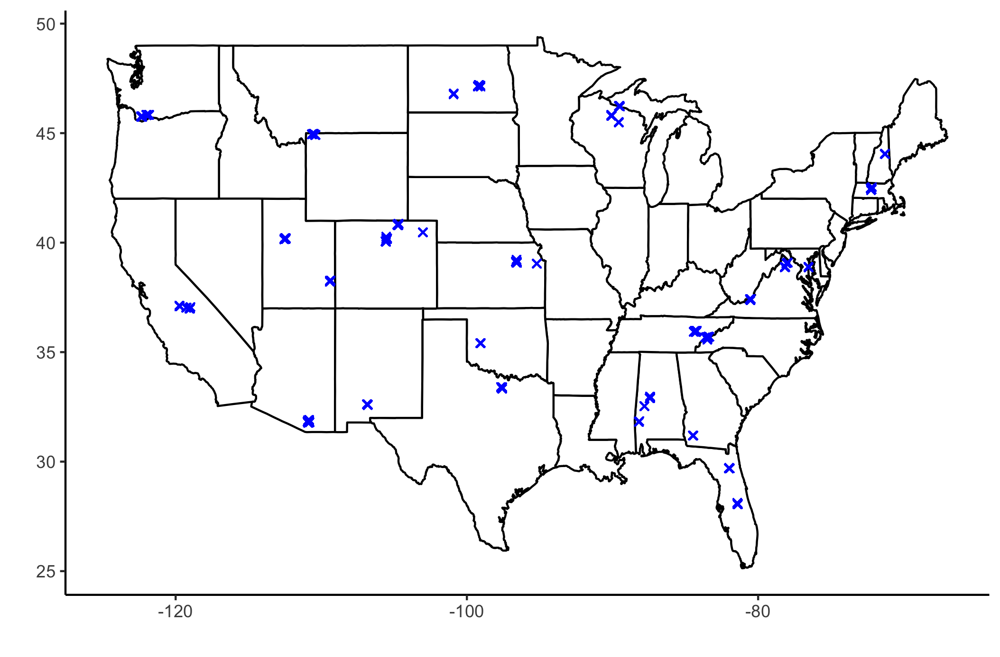
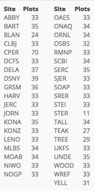
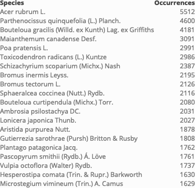

## Curated NEON datasets

Contains scripts for downloading and cleaning data, and the resulting data files. 
Metadata for original and curated datasets are in this README. 

### 1. Plant cover

#### Original data

- **Plant presence and percent cover** dataset 
- Product ID *DP1.10058.001*
- [Data portal link](https://data.neonscience.org/data-products/DP1.10058.001)
- Summary: Plant cover for each species of plant was estimated in six 1m2 subplots within 400m2 plots, where plant cover was percent of subplot ground covered as viewed from above. Each site has around 30 plots, with sites distributed across the USA. Plant cover was taken multiple times per year over multiple years, depending on the site. 
- Columns: 
  - `uid`
  - `namedLocation`             
  - `domainID`                   
  - `siteID`                    
  - `decimalLatitude`            
  - `decimalLongitude`          
  - `geodeticDatum`              
  - `coordinateUncertainty`     
  - `elevation`                  
  - `elevationUncertainty`      
  - `nlcdClass`                  
  - `plotID`                    
  - `subplotID`                  
  - `endDate`                   
  - `boutNumber`                 
  - `samplingProtocolVersion`   
  - `divDataType`                
  - `targetTaxaPresent`         
  - `otherVariablesPresent`      
  - `taxonID`                   
  - `scientificName`             
  - `taxonRank`                 
  - `family`                     
  - `nativeStatusCode`          
  - `identificationQualifier`    
  - `taxonIDRemarks`            
  - `morphospeciesID`            
  - `morphospeciesIDRemarks`    
  - `identificationReferences`   
  - `otherVariables`            
  - `percentCover`               
  - `heightPlantOver300cm`      
  - `heightPlantSpecies`         
  - `remarks`                   
  - `measuredBy`                 
  - `recordedBy`                
  - `samplingImpractical`        
  - `samplingImpracticalRemarks`
  - `biophysicalCriteria`    
- Additional useful information
  - Some plants have vouchers/tissues collected that may be useful for genetic analyses
  - The only data for plant height is `heightPlantOver300cm`, which indicates whether plants are taller than 9.8 feet

#### File structure

- `plant_cover` folder
  - Scripts
    - `curate_data.R` cleans up data
    - `summarize_data.R` creates summary stats, tables, and figures of data
  - Derived data and figures
    - `plant_cover.csv` is curated data
    - All `.png` images result from `summarize_data.R` and are displayed below

#### Curated data details

Columns: 

- `species`
- `lat`
- `lon`
- `sitename`
- `date`
- `canopy_cover`
- `uid` 

Summary figures and stats: 

**Locations**

- 39 sites with 1,307 total plots
- Coordinates correspond to plot, not subplot
- Map of plot locations: 

- Table of number of plots per site:  

**Taxonomy**

- ~290,000 records for 3,035 species
- Table of the 20 species with the most records and their number of occurrences: 

**Time**

- Records taken on 861 days from June 24, 2013 to November 12, 2019
- Plot of number of records per day across entire time range: 

