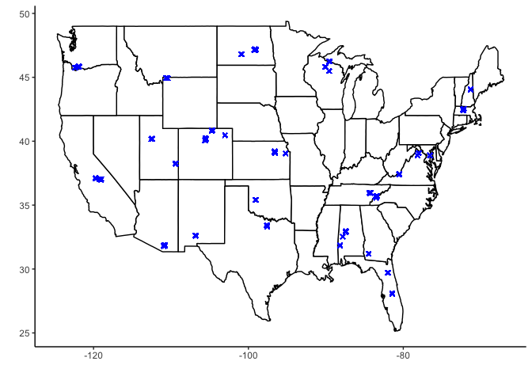
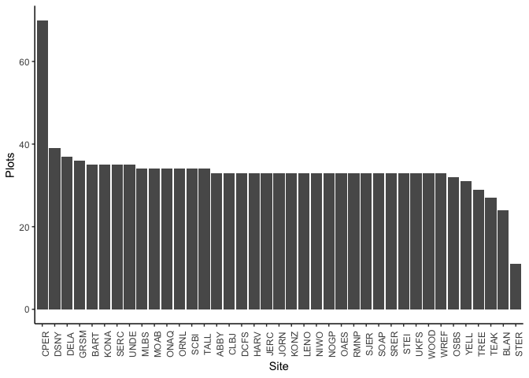
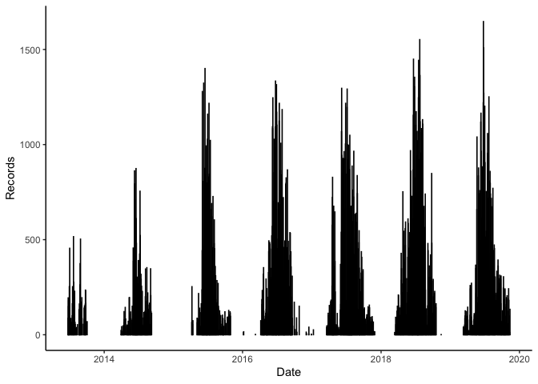
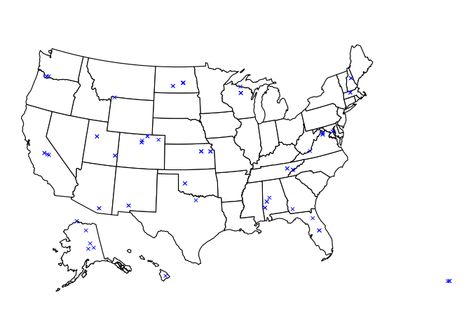
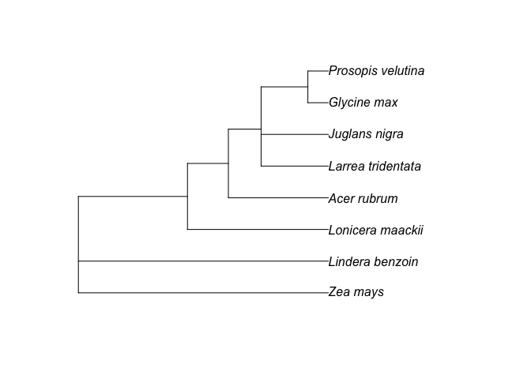

Curated NEON datasets
================

Contains scripts for downloading and cleaning data, and the resulting
data files. Metadata for original and curated datasets are in this
README.

### 1\. Plant cover

#### Original data

  - **Plant presence and percent cover** dataset
  - Product ID *DP1.10058.001*
  - [Data portal
    link](https://data.neonscience.org/data-products/DP1.10058.001)
  - Summary: Plant cover for each species of plant was estimated in six
    1m2 subplots within 400m2 plots, where plant cover was percent of
    subplot ground covered as viewed from above. Each site has around 30
    plots, with sites distributed across the USA. Plant cover was taken
    multiple times per year over multiple years, depending on the site.
  - Additional useful information
      - Some plants have vouchers/tissues collected that may be useful
        for genetic analyses
      - The only data for plant height is `heightPlantOver300cm`, which
        indicates whether plants are taller than 9.8 feet

#### File structure

  - `plant_cover` folder
      - Scripts
          - `curate_data.R` cleans up data
      - Derived data and figures
          - `plant_cover.csv` is curated data

#### Curated data details

Columns:

  - `species`: species identification
  - `lat`: latitude of plot (decimal degrees)
  - `lon`: longitude of plot (decimal degrees)
  - `sitename`: site, plot, and subplot info combined in format
    `sitecode_plotID_subplotID`; e.g., `DSNY_DSNY_017_32.4.1` is site
    DSNY, plot 017, subplot 32.4.1
  - `date`: date of end of sampling in format YYYY-MM-DD
  - `canopy_cover`: amount of ground covered by that species in 1m2 area
    (%)
  - `uid`: unique identifier for each record as assigned by NEON

Summary figures and stats:

**Locations**

  - 39 sites with 1307 total plots
  - Coordinates correspond to plot, not subplot
  - Map of plot locations:

<!-- -->

  - Figure of number of plots per site, ordered by number of plots:

<!-- -->

**Taxonomy**

  - 293078 records for 3035 species
  - Table of the 20 species with the most records and their number of
    occurrences:

| Species                                                | Occurrences |
| :----------------------------------------------------- | ----------: |
| Acer rubrum L.                                         |        5512 |
| Parthenocissus quinquefolia (L.) Planch.               |        4600 |
| Bouteloua gracilis (Willd. ex Kunth) Lag. ex Griffiths |        4181 |
| Maianthemum canadense Desf.                            |        3091 |
| Poa pratensis L.                                       |        2991 |
| Toxicodendron radicans (L.) Kuntze                     |        2986 |
| Schizachyrium scoparium (Michx.) Nash                  |        2387 |
| Bromus inermis Leyss.                                  |        2195 |
| Bromus tectorum L.                                     |        2126 |
| Sphaeralcea coccinea (Nutt.) Rydb.                     |        2116 |
| Bouteloua curtipendula (Michx.) Torr.                  |        2080 |
| Ambrosia psilostachya DC.                              |        2031 |
| Lonicera japonica Thunb.                               |        2027 |
| Aristida purpurea Nutt.                                |        1878 |
| Gutierrezia sarothrae (Pursh) Britton & Rusby          |        1808 |
| Plantago patagonica Jacq.                              |        1762 |
| Pascopyrum smithii (Rydb.) Á. Löve                     |        1761 |
| Vulpia octoflora (Walter) Rydb.                        |        1737 |
| Hesperostipa comata (Trin. & Rupr.) Barkworth          |        1630 |
| Microstegium vimineum (Trin.) A. Camus                 |        1629 |

**Time**

  - Records taken on 861 days from 2013-06-24 to 2019-11-12
  - Plot of number of records per day across entire time range:

<!-- -->

### 2\. Phenology measurements

#### Original data

  - **Plant phenology observations** dataset
  - Product ID *DP1.10055.001*
  - [Data portal
    link](https://data.neonscience.org/data-products/DP1.10055.001)
  - Summary: Phenophase status recorded for ~100 individual plants at
    each site across multiple years. Records are made for all plants up
    to multiple times a week depending on phenology activity. Each site
    has one transect along which all plants are included, with each
    individual plant tracked across each year. Tracked phenophases
    include initial growth, young leaves/needles, open flowers/pollen
    cones, colored leaves/needles, and falling leaves/needles.

#### File structure

  - `phenology` folder
      - Scripts
          - `curate_data.R` cleans up data
      - Derived data and figures
          - `phenology.csv` is curated data

#### Curated data details

Columns:

  - `individualID`: unique identifier assigned to each plant
  - `species`: species identification
  - `lat`: latitude of plot (decimal degrees)
  - `lon`: longitude of plot (decimal degrees)
  - `sitename`: site and unique transect identifier, in the format
    site\_plotID
  - `first_flower_date`: earliest date per year for each individual to
    reach at least 50% of flowers open (i.e., `open flowers` is
    categorized as `50-74%`)
  - `uid_pheno`: unique identifier for the phenophase record
  - `uid_ind`: unique identifier for the individual record

Summary figures and stats:

**Locations**

  - 47 sites with 72 total transects
  - From 1 to 3 transects per site
  - Map of transect locations:

<!-- -->

**Taxonomy**

  - 3124 records for 103 species
  - Table of the 20 species with the most records and their number of
    occurrences:

| Species                                | Occurrences |
| :------------------------------------- | ----------: |
| Liriodendron tulipifera L.             |         141 |
| Acer rubrum L.                         |         109 |
| Gaultheria shallon Pursh               |         106 |
| Betula glandulosa/nana                 |         100 |
| Zinnia acerosa (DC.) A. Gray           |          98 |
| Vaccinium vitis-idaea L.               |          90 |
| Lonicera maackii (Rupr.) Herder        |          88 |
| Acer pensylvanicum L.                  |          86 |
| Juglans nigra L.                       |          85 |
| Pithecellobium dulce (Roxb.) Benth.    |          83 |
| Minuartia obtusiloba (Rydb.) House     |          77 |
| Erodium botrys (Cav.) Bertol.          |          74 |
| Poa pratensis L.                       |          69 |
| Prosopis glandulosa Torr.              |          69 |
| Urochloa maxima (Jacq.) R. Webster     |          69 |
| Larrea tridentata (DC.) Coville        |          67 |
| Thelesperma filifolium (Hook.) A. Gray |          67 |
| Lindera benzoin (L.) Blume             |          65 |
| Symphoricarpos occidentalis Hook.      |          62 |
| Rhamnus davurica Pall.                 |          59 |

  - Table of the 20 species with the most individuals recorded and the
    number of individuals:

| Species                                | Individuals |
| :------------------------------------- | ----------: |
| Liriodendron tulipifera L.             |          80 |
| Acer rubrum L.                         |          66 |
| Acer pensylvanicum L.                  |          63 |
| Gaultheria shallon Pursh               |          56 |
| Vaccinium vitis-idaea L.               |          54 |
| Betula glandulosa/nana                 |          51 |
| Zinnia acerosa (DC.) A. Gray           |          49 |
| Poa pratensis L.                       |          45 |
| Thelesperma filifolium (Hook.) A. Gray |          41 |
| Artemisia absinthium L.                |          40 |
| Symphoricarpos occidentalis Hook.      |          39 |
| Lindera benzoin (L.) Blume             |          36 |
| Erodium botrys (Cav.) Bertol.          |          35 |
| Artemisia tridentata Nutt.             |          34 |
| Lonicera maackii (Rupr.) Herder        |          34 |
| Minuartia obtusiloba (Rydb.) House     |          33 |
| Juglans nigra L.                       |          32 |
| Larrea tridentata (DC.) Coville        |          31 |
| Prosopis glandulosa Torr.              |          31 |
| Pithecellobium dulce (Roxb.) Benth.    |          30 |

**Time**

  - Records taken on 635 days from 2013-10-02 to 2020-10-21
  - Plot of number of records per day across entire time range:

<!-- -->

### 3\. Phenology images

#### Original data

  - **Phenology images** dataset
  - Product ID *DP1.00033.001*
  - [Data portal
    link](https://data.neonscience.org/data-products/DP1.00033.001)
      - Data stored on
        [PhenoCam](https://phenocam.sr.unh.edu/webcam/about/) website
        [here](https://phenocam.sr.unh.edu/webcam/network/search/?sitename=&type=&primary_vegtype=&dominant_species=&active=unknown&fluxdata=unknown&group=neon);
        probably have to be downloaded individually by site?
  - Summary: Images (RGB and IR) taken from tops of towers at each site
    every 15 minutes, available for most sites back to early 2017.

### 4\. Mammal diversity

#### Original data

  - **Small mammal box trapping** dataset
  - Product ID *DP1.10072.001*
  - [Data portal
    link](https://data.neonscience.org/data-products/DP1.10072.001)
  - Summary: For all sites starting in 2016, individual small mammals
    were trapped and identified 4-6 times per year.

### 5\. Bird diversity

#### Original data

  - **Breeding landbird point counts** dataset
  - Product ID *DP1.10003.001*
  - [Data portal
    link](https://data.neonscience.org/data-products/DP1.10003.001)
  - Summary: Species identifications of individual non-large and
    non-aquatic birds from a point. Each site has 5-10 grids with 9
    points per grid (45-90 points), with counts occurring once or twice
    a year since 2017 for most sites.

### 6\. Mosquito diversity

#### Original data

  - **Mosquitoes sampled from CO2 traps** dataset
  - Product ID *DP1.10043.001*
  - [Data portal
    link](https://data.neonscience.org/data-products/DP1.10043.001)
  - Summary: All sites were sampled, starting in 2016 for some, once to
    twice a week at 10 plots per site (note: sampling design changed
    somewhat in 2018). Subsamples from traps were identified to taxon
    and includes abundance numbers.

### 7\. Beetle diversity

#### Original data

  - **Ground beetles sampled from pitfall traps** dataset
  - Product ID *DP1.10022.001*
  - [Data portal
    link](https://data.neonscience.org/data-products/DP1.10022.001)
  - Summary: All sites were sampled, starting in 2016 for most, twice a
    week at 10 plots per site. Individuals from traps were identified to
    species.
